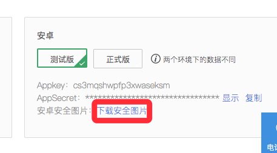
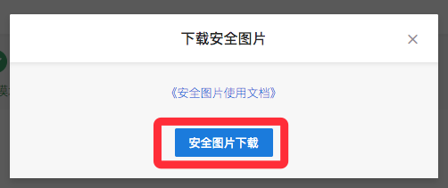
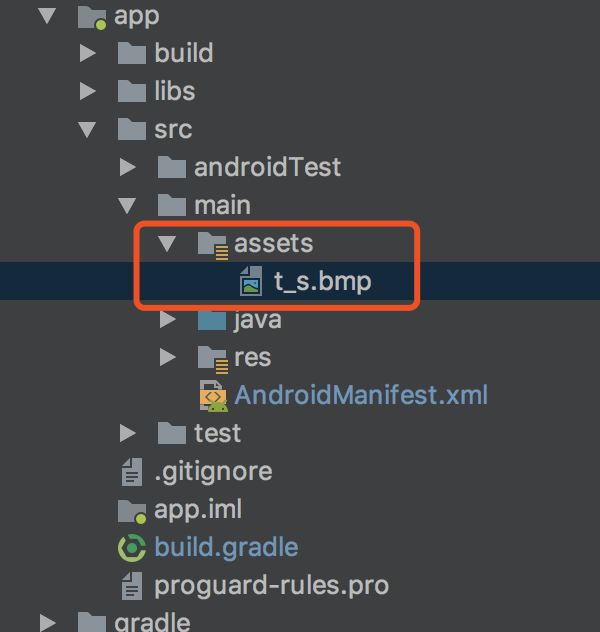

# 集成TuyaRnSDK
## 集成准备
## 开发环境准备
1. 配置相关react-native 环境 [react-native环境搭建](https://reactnative.cn/docs/getting-started.html)  请采用react-native 0.58版本
2. 首先找一个文件夹 执行react-native init 项目名
（例如 react-native init TuyaSdkTest）

## Android 篇介绍

###  一.拉取相关代码
点击`https://github.com/TuyaInc/tuyasmart-home-sdk-react-native/tree/master/Example/android`


将以下模块倒入到你的react-native 的Android模块当中

###  二. 工程配置
在Android的setting.gradle里 将Android代码导入

```
include ':app', ':tuyasmart-sdk-react-native'
```
在你的app的build.gradle里 添加模块依赖

```
dependencies {
    ……
    implementation project(':tuyasmart-sdk-react-native')
    ……
}
```
> 【注意事项】
> 涂鸦智能sdk默认只支持armeabi-v7a，如有其他平台需要可前往[GitHub](https://github.com/TuyaInc/tuyasmart_home_android_sdk/tree/master/so_libs)获取

### 三、集成安全图片

点击"下载安全图片" ——"安全图片下载" 下载安全图片。





在集成准备中点击“下载安全图片”。将下载的安全图片命名为“t_s.bmp”，放置到工程目录的assets/文件夹下。




### 四、AndroidManifest.xml 设置Appkey和AppSecret

在AndroidManifest.xml文件里配置appkey和appSecret，在配置相应的权限等

```xml
<meta-data
android:name="TUYA_SMART_APPKEY"
android:value="应用Appkey" />
<meta-data
android:name="TUYA_SMART_SECRET"
android:value="应用密钥AppSecret" />

```
### 五、混淆配置

在proguard-rules.pro文件配置相应混淆配置

```bash
#fastJson
-keep class com.alibaba.fastjson.**{*;}
-dontwarn com.alibaba.fastjson.**

#mqtt
-keep class org.eclipse.paho.client.mqttv3.** { *; }
-dontwarn org.eclipse.paho.client.mqttv3.**

-keep class com.squareup.okhttp.** { *; }
-keep interface com.squareup.okhttp.** { *; }
-dontwarn com.squareup.okhttp.**

-keep class okio.** { *; }
-dontwarn okio.**

-keep class com.tuya.**{*;}
-dontwarn com.tuya.**
```

## iOS 篇介绍

### 一、 cocoapods安装相关依赖:
``` ruby
 platform :ios, '8.0'
 target 'Your_Project_Name' do
    pod "TuyaSmartHomeKit"
    pod 'React', :path => 'path/to/node_modules/react-native/', :subspecs => [
        'Core',
        'CxxBridge',
        'ART',
        'RCTActionSheet',
        'RCTAnimation',
        'RCTGeolocation',
        'RCTImage',
        'RCTNetwork',
        'RCTPushNotification',
        'RCTSettings',
        'RCTText',
        'RCTImage',
        'RCTVibration',
        'RCTWebSocket',
        'RCTLinkingIOS',
        'DevSupport'
    ]
    
    pod 'yoga', :path => 'path/to/node_modules/react-native/ReactCommon/yoga'
    pod 'RNSVG', :path => 'path/to/node_modules/react-native-svg'
    pod 'DoubleConversion', :podspec => '../node_modules/react-native/third-party-podspecs/DoubleConversion.podspec'
    pod 'glog', :podspec => 'path/to/node_modules/react-native/third-party-podspecs/glog.podspec'
    pod 'Folly', :podspec => 'path/to/node_modules/react-native/third-party-podspecs/Folly.podspec'
    end
```
### 二、把 [TuyaRNSDK](https://github.com/TuyaInc/tuyasmart-home-sdk-react-native/tree/master/Example/ios/TuyaRnDemo/TuyaRNSDK) 中的文件拖到你的工程中.
### 三、 把安全图片放入工程根目录，并在 AppDelegate.m 文件中配置key和secret (参考 [SDK doc](https://tuyainc.github.io/tuyasmart_home_ios_sdk_doc/zh-hans/resource/Preparation.html)):

``` objective-c
  [[TuyaSmartSDK sharedInstance] startWithAppKey:@"" secretKey:@""];
```


## 在代码中使用SDK功能

TuyaHomeSdk 是一切全屋智能API对外的接口，包含：配网、初始化、控制、房间、群组、ZigBee等一系列的操作。
### 一、 Application中初始化涂鸦智能sdk。
**描述**

主要用于初始化通信服务等组件。

**代码范例**

```java
@Override
  public void onCreate() {
    super.onCreate();
    SoLoader.init(this, /* native exopackage */ false);
    // Fill in appkey and appsecret of the application below
   // TuyaCoreModule.Companion.initTuyaSDKWithoutOptions();
  //TuyaCoreModule.Companion.initTuyaSDk("xxxxxxxxxxxxxxxxxxxxx","xxxxxxxxxxxxxxxxxxxxx",this);

  }

```

>注意事项
>appId和appSecret需要配置AndroidManifest.xml文件里，或者在build环境里配置，也可以在代码里写入。


### 二、 注销涂鸦智能云连接
在退出应用的时候调用以下接口注销掉。

```java
TuyaCoreModule.Companion.onDestroy();
```

### 三、debug开关

在debug模式下可以开启sdk的日志开关，查看更多的日志信息，帮助快速定位问题。在release模式下建议关闭日志开关

```java
 TuyaCoreModule.Companion.setSDKDebug(true)
```


