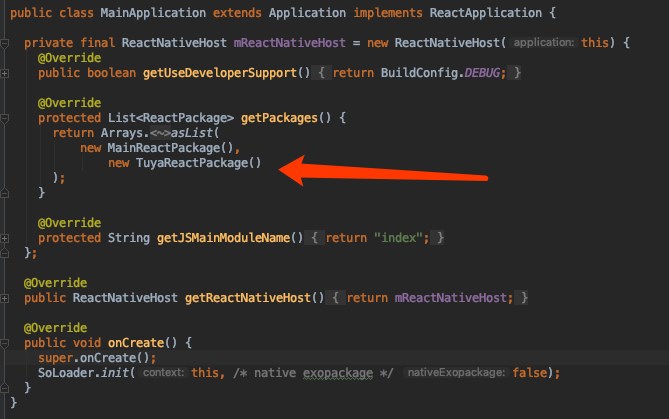

# 集成TuyaRnSDK
## 集成准备
## 开发环境准备
1. 配置相关react-native 环境 [react-native环境搭建](https://reactnative.cn/docs/getting-started.html)  请采用react-native 0.57版本
2. 首先找一个文件夹 执行react-native init 项目名
（例如 react-native init TuyaSdkTest）

## Android 篇介绍
### 一、打开工程

用Android studio或者eclipse打开第一步执行的react-native工程里的android工程

### 二、引入aar包

 

### 三、build.gradle 配置

在app build.gradle 文件里添加如下配置

```groovy
apply plugin: "com.android.application"
apply plugin: 'maven'
import com.android.build.OutputFile

project.ext.react = [
    entryFile: "index.js"
]

apply from: "../../node_modules/react-native/react.gradle"

def enableSeparateBuildPerCPUArchitecture = false
def enableProguardInReleaseBuilds = false

android {
    compileSdkVersion rootProject.ext.compileSdkVersion
    buildToolsVersion rootProject.ext.buildToolsVersion

    defaultConfig {
        applicationId "com.tuyasdktest"
        minSdkVersion rootProject.ext.minSdkVersion
        targetSdkVersion rootProject.ext.targetSdkVersion
        versionCode 1
        versionName "1.0"
        multiDexEnabled true
        ndk {
            abiFilters "armeabi-v7a", "x86"
        }
    }
    splits {
        abi {
            reset()
            enable enableSeparateBuildPerCPUArchitecture
            universalApk false  // If true, also generate a universal APK
            include "armeabi-v7a", "x86"
        }
    }
    buildTypes {
        release {
            minifyEnabled enableProguardInReleaseBuilds
            proguardFiles getDefaultProguardFile("proguard-android.txt"), "proguard-rules.pro"
        }
    }
    // applicationVariants are e.g. debug, release
    applicationVariants.all { variant ->
        variant.outputs.each { output ->
            // For each separate APK per architecture, set a unique version code as described here:
            // http://tools.android.com/tech-docs/new-build-system/user-guide/apk-splits
            def versionCodes = ["armeabi-v7a":1, "x86":2]
            def abi = output.getFilter(OutputFile.ABI)
            if (abi != null) {  // null for the universal-debug, universal-release variants
                output.versionCodeOverride =
                        versionCodes.get(abi) * 1048576 + defaultConfig.versionCode
            }
        }
    }
}

dependencies {
    implementation fileTree(dir: "libs", include: ["*.jar"])
    implementation 'com.android.support:appcompat-v7:26.1.0'
    implementation 'com.android.support:multidex:1.0.1'
    implementation 'com.alibaba:fastjson:1.1.68.android'
    api "org.jetbrains.kotlin:kotlin-stdlib-jre7:1.2.71"
    implementation "com.facebook.react:react-native:+"  // From node_modules
    implementation(name: 'tuyasmartrn-2.7.2', ext: 'aar')
    implementation(name: 'tuyasmart-2.7.2', ext: 'aar')
}


task copyDownloadableDepsToLibs(type: Copy) {
    from configurations.compile
    into 'libs'
}

repositories {
    maven {
        // All of React Native (JS, Obj-C sources, Android binaries) is installed from npm
        url "$projectDir/../node_modules/react-native/android"
    }
    mavenCentral()
    google()
    flatDir {
        dirs 'libs'
    }
}
```

> 【注意事项】
>涂鸦智能sdk默认只支持armeabi-v7a和x86架构的平台，如有其他平台需要可前往[GitHub](https://github.com/TuyaInc/tuyasmart_android_sdk/tree/master/library)获取

### 四、AndroidManifest.xml 设置

在AndroidManifest.xml文件里配置appkey和appSecret，在配置相应的权限等

```xml
<meta-data
android:name="TUYA_SMART_APPKEY"
android:value="应用id" />
<meta-data
android:name="TUYA_SMART_SECRET"
android:value="应用密钥" />

添加必要的权限支持
<!-- sdcard -->
<uses-permission android:name="android.permission.WRITE_EXTERNAL_STORAGE" />
<uses-permission android:name="android.permission.READ_EXTERNAL_STORAGE" />
<uses-permission android:name="android.permission.READ_PHONE_STATE" android:required="false"/>
<!-- 网络 -->
<uses-permission android:name="android.permission.INTERNET" />
<uses-permission android:name="android.permission.CHANGE_NETWORK_STATE" />
<uses-permission android:name="android.permission.CHANGE_WIFI_STATE" />
<uses-permission android:name="android.permission.ACCESS_NETWORK_STATE" />
<uses-permission android:name="android.permission.ACCESS_WIFI_STATE" />
<uses-permission android:name="android.permission.WAKE_LOCK"android:required="false" />
<!-- added from 2.7.2 -->
  <uses-permission android:name="android.permission.CHANGE_WIFI_MULTICAST_STATE" android:required="false"/>


添加必要的service和receiver
//<service android:name="org.eclipse.paho.android.service.MqttService" />
//from 2.6.3 com.tuya.smart.mqtt.MqttService replace the org.eclipse.paho.android.service.mqttservice
    <service android:name="com.tuya.smart.mqtt.MqttService" android:stopWithTask="true"/>

<receiver android:name="com.tuya.smart.android.base.broadcast.NetworkBroadcastReceiver">
<intent-filter>
<action android:name="android.net.conn.CONNECTIVITY_CHANGE" />
</intent-filter>
</receiver>

<service
android:name="com.tuya.smart.android.hardware.service.GwBroadcastMonitorService"
android:exported="true"
android:label="UDPService"
android:process=":monitor">
<intent-filter>
<action android:name="tuya.intent.action.udp" />

<category android:name="tuya" />
</intent-filter>
</service>
<service
    android:name="com.tuya.smart.android.hardware.service.DevTransferService"
    android:label="TCPService">
    <intent-filter>
    	<action android:name="tuya.intent.action.tcp" />
           <category android:name="tuya" />
        </intent-filter>
</service>

```

### 五、混淆配置

在proguard-rules.pro文件配置相应混淆配置

```shell
#fastJson
-keep class com.alibaba.fastjson.**{*;}
-dontwarn com.alibaba.fastjson.**

#netty
-keep class io.netty.** { *; }
-dontwarn io.netty.**

#mqtt
-keep class org.eclipse.paho.client.mqttv3.** { *; }
-dontwarn org.eclipse.paho.client.mqttv3.**

-dontwarn okio.**
-dontwarn rx.**
-dontwarn javax.annotation.**
-keep class com.squareup.okhttp.** { *; }
-keep interface com.squareup.okhttp.** { *; }
-keep class okio.** { *; }
-dontwarn com.squareup.okhttp.**

-keep class com.tuya.**{*;}
-dontwarn com.tuya.**
```

### 六、引用TuyaReactPackage
打开app中的MainApplication类，添加 new TuyaReactPackage()
 


### 七、添加TuyaAPi文件夹
将github上下载的TuyaApi文件夹放到项目根目录当中
 

## 在代码中使用SDK功能

TuyaRNSdk 是一切全屋智能API对外的接口，包含：配网、初始化、控制、房间、群组、ZigBee等一系列的操作。


